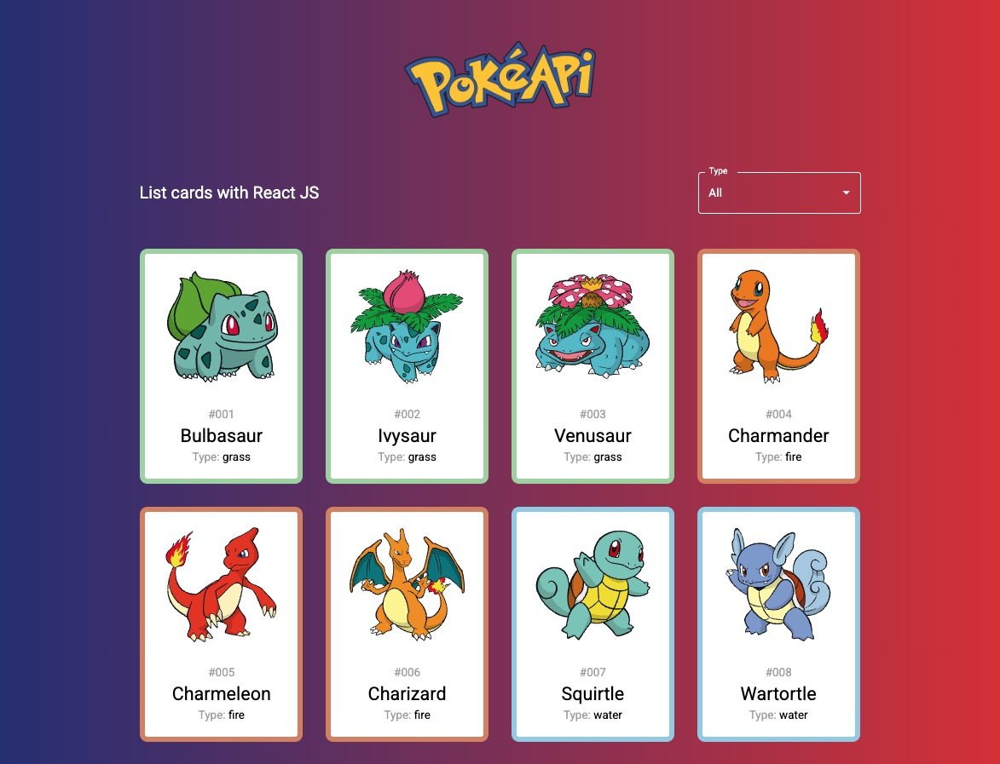

List of Pokémon cards using [PokéAPI](https://pokeapi.co) and React JS. [See the project](https://caueamaral.github.io/react-pokeapi).



## React

- Material UI
- axios
- useEffect()
- useState()

### How to use it

1 - Clone the repository

```sh
git clone https://github.com/caueamaral/react-pokeapi.git
```

2 - Install the dependencies

```sh
npm install
```

3 - Start the web server

```sh
npm run dev
```

4 - Open localhost in the browser

```sh
http://localhost:5173
```
